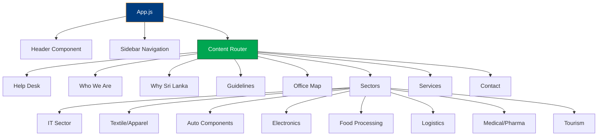

# 🇱🇰 Board of Investment Sri Lanka - Virtual Help Desk

<div align="center">


**A Modern, Interactive Investment Portal for Sri Lanka**

[](https://reactjs.org/)
[](https://www.framer.com/motion/)
[](https://lucide.dev/)

</div>

---

## 🌟 Project Overview

The **BOI Sri Lanka Virtual Help Desk** is a comprehensive web application designed to assist investors in navigating investment opportunities in Sri Lanka. Built with modern React technology and featuring stunning animations, this platform serves as a one-stop solution for potential investors seeking information about Sri Lanka's investment landscape.

---

## ✨ Features

### 🖥️ **Interactive Virtual Help Desk**
- Dynamic background slideshow with Sri Lankan imagery
- QR code integration for quick access to digital resources
- Real-time information display

### 🏛️ **Comprehensive Information Sections**
- **Who We Are**: BOI history, leadership, and achievements
- **Why Sri Lanka**: Investment advantages and opportunities
- **Investment Guidelines**: Step-by-step investment process
- **Office Maps**: Interactive location information
- **Investment Sectors**: Detailed sector-specific information
- **Services**: Complete service portfolio with animations
- **Contact Information**: Multiple contact channels

### 🎨 **Modern UI/UX Design**
- Gradient backgrounds with animated elements
- Smooth transitions and hover effects
- Responsive design for all devices
- Professional color scheme (BOI Blue: `#003d80`, Orange: `#f7941d`)

### 🚀 **Advanced Animations**
- Framer Motion-powered animations
- Particle effects and floating elements
- Interactive cards with expand/collapse functionality
- Smooth page transitions

---

## 🏗️ Architecture



---

## 🛠️ Technology Stack

### **Frontend Framework**
- **React 18.2.0** - Modern component-based architecture
- **React Scripts 5.0.1** - Build toolchain and development server

### **Animation & UI Libraries**
- **Framer Motion 12.23.12** - Advanced animations and transitions
- **Lucide React 0.544.0** - Beautiful, customizable icons

### **Styling**
- **Custom CSS** - Tailored design system with CSS variables
- **Responsive Grid** - Mobile-first approach
- **CSS Animations** - Custom keyframe animations

### **Assets & Resources**
- **Google Fonts** - Roboto & Poppins typography
- **Font Awesome 6.4.0** - Additional icon support
- **High-quality Images** - Professional investment imagery

---

## 📂 Project Structure

```
boi-sri-lanka-virtual-help-desk/
├── public/
│   ├── index.html
│   └── favicon.ico
├── src/
│   ├── components/
│   │   ├── Header.js
│   │   ├── Sidebar.js
│   │   ├── Content.js
│   │   └── tabs/
│   │       ├── HelpDesk.js
│   │       ├── WhoWeAre.js
│   │       ├── WhySriLanka.js
│   │       ├── Guideline.js
│   │       ├── OfficeMap.js
│   │       ├── Sectors.js
│   │       ├── Services.js
│   │       ├── Contact.js
│   │       └── pages/
│   │           ├── InformationTechnology.js
│   │           ├── TextileApparel.js
│   │           ├── AutoComponents.js
│   │           ├── ElectricalElectronics.js
│   │           ├── FoodProcessing.js
│   │           ├── Logistics.js
│   │           ├── MedicalPharmaceutical.js
│   │           └── TourismLeisure.js
│   ├── assets/
│   │   └── frame.jpg (QR Code)
│   ├── App.js
│   ├── App.css
│   ├── index.js
│   └── index.css
├── package.json
└── README.md
```

---

## 🚀 Getting Started

### Prerequisites
- **Node.js** (v14 or higher)
- **npm** or **yarn** package manager

### Installation

1. **Clone the repository**
   ```bash
   git clone https://github.com/yourusername/boi-sri-lanka-virtual-help-desk.git
   cd boi-sri-lanka-virtual-help-desk
   ```

2. **Install dependencies**
   ```bash
   npm install
   # or
   yarn install
   ```

3. **Start the development server**
   ```bash
   npm start
   # or
   yarn start
   ```

4. **Open your browser**
   Navigate to `http://localhost:3000` to view the application.

### Build for Production
```bash
npm run build
# or
yarn build
```

---

## 🎨 Design System

### **Color Palette**
```css
:root {
  --primary: #003d80;       /* BOI Blue */
  --secondary: #f7941d;     /* Orange */
  --accent: #00a651;        /* Green */
  --light: #f8f9fa;         /* Light Background */
  --dark: #212529;          /* Dark Text */
  --gray: #6c757d;          /* Secondary Text */
}
```

### **Typography**
- **Primary Font**: Roboto (300, 400, 500, 700)
- **Accent Font**: Poppins (400, 500, 600, 700)

### **Animation Principles**
- **Duration**: 0.3s for interactions, 0.8s for page loads
- **Easing**: `cubic-bezier(0.25, 0.8, 0.25, 1)` for smooth transitions
- **Hover Effects**: Subtle scale and shadow changes

---

## 🔧 Available Scripts

| Script | Description |
|--------|-------------|
| `npm start` | Runs the app in development mode |
| `npm test` | Launches the test runner |
| `npm run build` | Builds the app for production |
| `npm run eject` | **One-way operation** - ejects from Create React App |

---

## 📱 Responsive Design

The application is fully responsive and optimized for:

- **Desktop** (1200px+)
- **Tablet** (768px - 1199px)
- **Mobile** (320px - 767px)

### Mobile Features
- Collapsible sidebar navigation
- Touch-optimized interactions
- Reduced animation complexity for performance
- Optimized image loading

---

## 📜 License

This project is developed for the Board of Investment of Sri Lanka. All rights reserved.

---

## 🙏 Acknowledgments

- **BOI Leadership Team** for vision and guidance
- **React Community** for excellent documentation
- **Framer Motion** for powerful animation tools
- **Lucide Icons** for beautiful iconography
- **Sri Lankan Investment Community** for feedback and support

---

